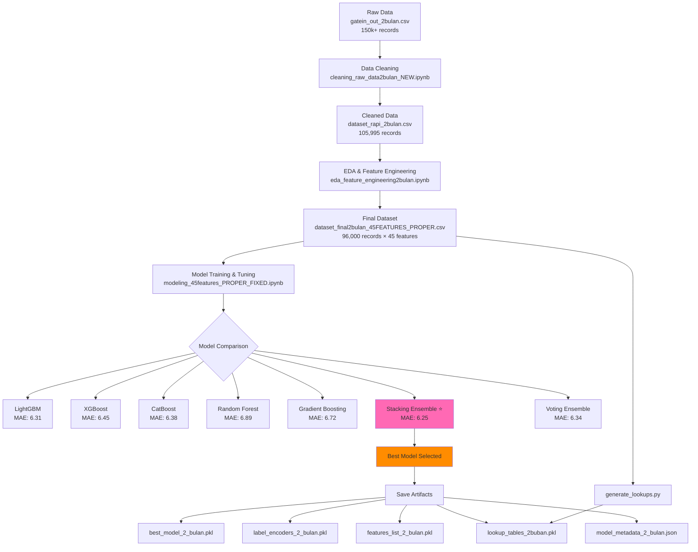
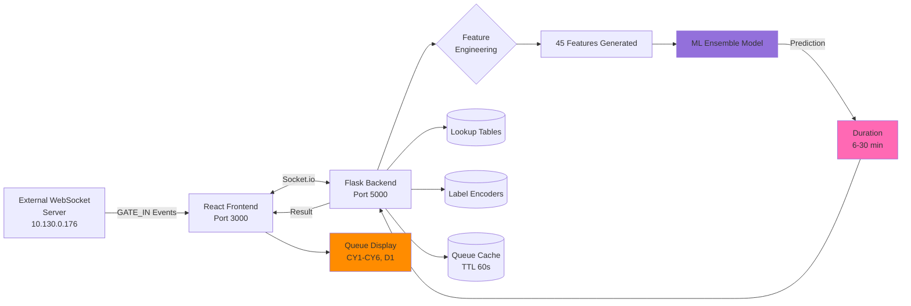
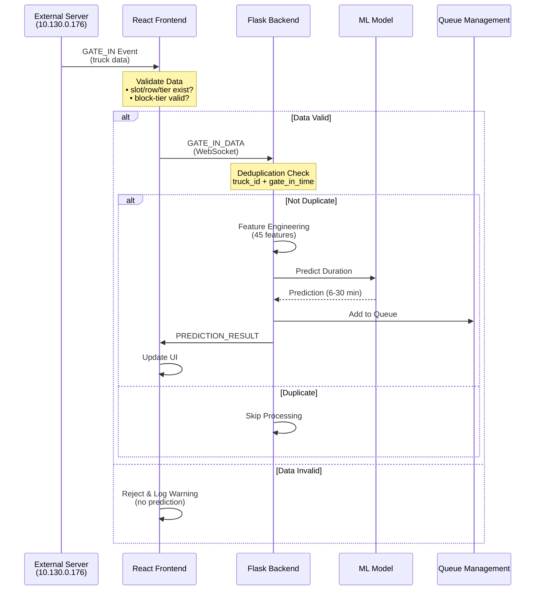
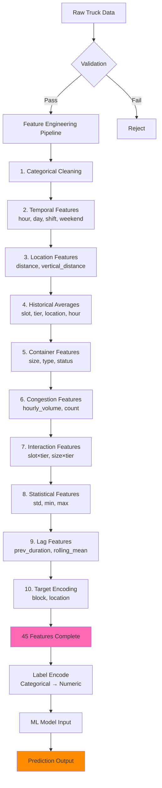
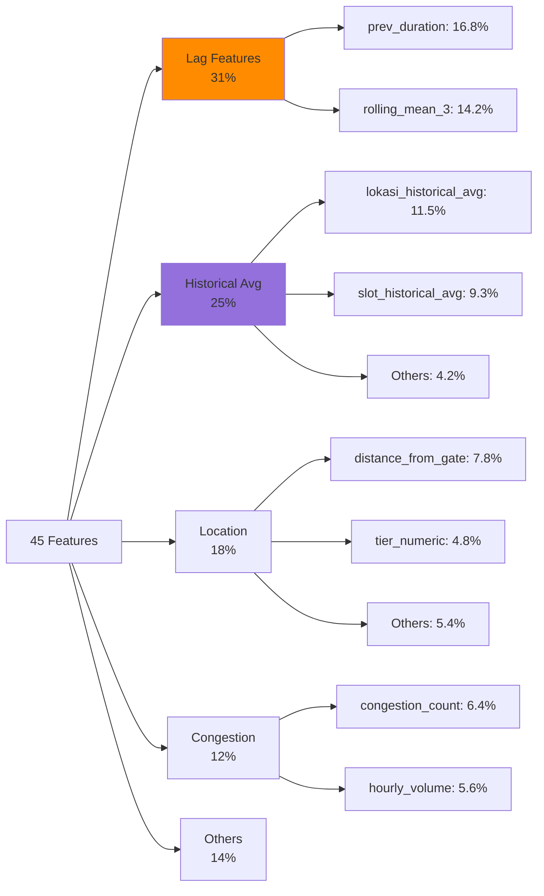
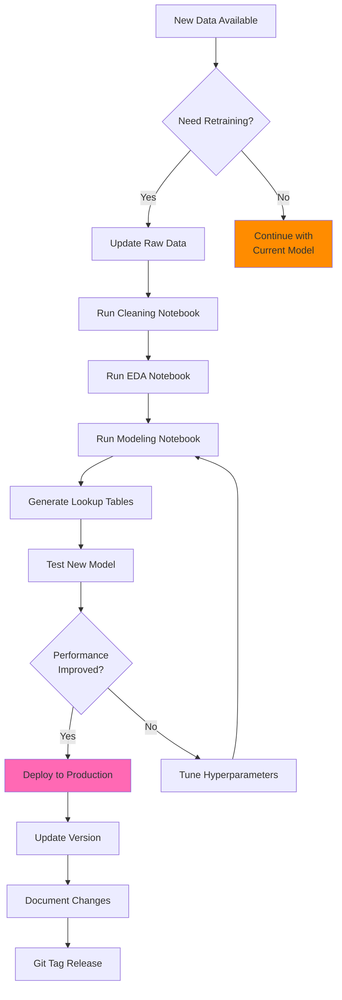
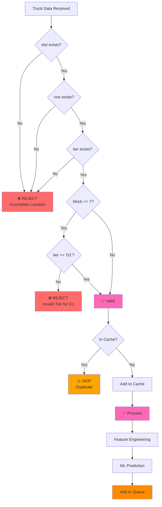
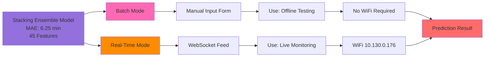

# Project Flowchart & Architecture

## Machine Learning Development Flow



## System Architecture Flow



## Real-Time Prediction Flow



## Data Transformation Pipeline



## Feature Importance Breakdown



## Development Workflow



## Data Validation Flow



---

## Application Modes (Same Model, Different Input)



---

## Model Comparison During Training

During the modeling phase, 7 algorithms were compared. Only the **Stacking Ensemble** was deployed to production.

```
┌─────────────────────┬──────────┬────────────┐
│ Algorithm           │ MAE      │ Status     │
├─────────────────────┼──────────┼────────────┤
│ Stacking Ensemble ⭐│ 6.25 min │ DEPLOYED   │
│ LightGBM            │ 6.31 min │ Comparison │
│ Voting Ensemble     │ 6.34 min │ Comparison │
│ CatBoost            │ 6.38 min │ Comparison │
│ XGBoost             │ 6.45 min │ Comparison │
│ Gradient Boosting   │ 6.72 min │ Comparison │
│ Random Forest       │ 6.89 min │ Comparison │
└─────────────────────┴──────────┴────────────┘

✅ Production Model: Stacking Ensemble only
📊 Training Data: 96,000 records × 45 features
```

---
