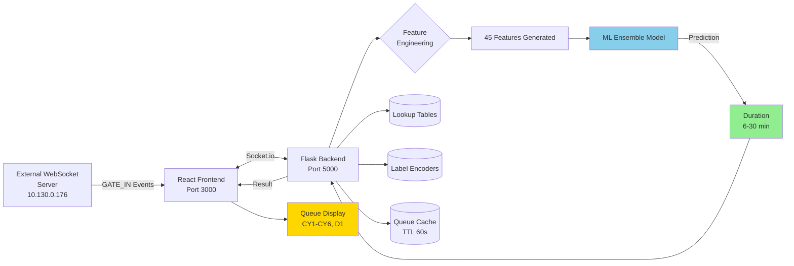
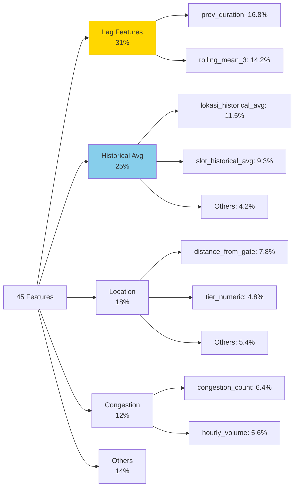
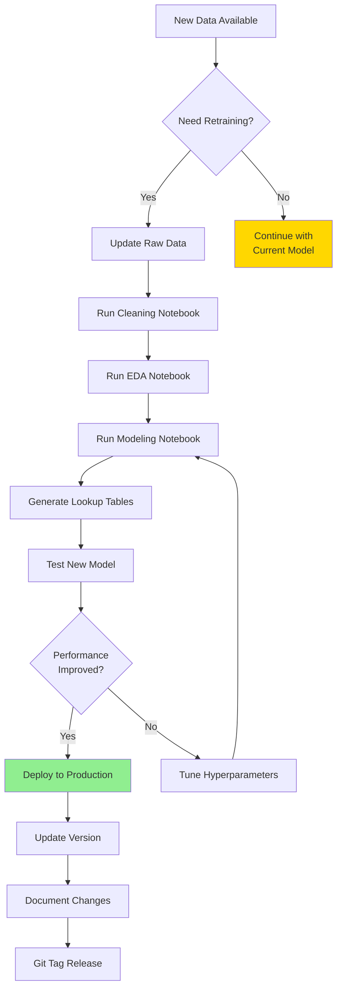

# 📊 Project Flowchart & Architecture

## 📈 Machine Learning Development Flow

```mermaid
graph TD
    A[Raw Data<br/>gatein_out_2bulan.csv<br/>150k+ records] --> B[Data Cleaning<br/>cleaning_raw_data2bulan_NEW.ipynb]
    
    B --> C[Cleaned Data<br/>dataset_rapi_2bulan.csv<br/>105,995 records]
    
    C --> D[EDA & Feature Engineering<br/>eda_feature_engineering2bulan.ipynb]
    
    D --> E[Final Dataset<br/>dataset_final2bulan_45FEATURES_PROPER.csv<br/>96,000 records × 45 features]
    
    E --> F[Model Training & Tuning<br/>modeling_45features_PROPER_FIXED.ipynb]
    
    F --> G{Model Comparison}
    
    G --> H[LightGBM<br/>MAE: 6.31]
    G --> I[XGBoost<br/>MAE: 6.45]
    G --> J[CatBoost<br/>MAE: 6.38]
    G --> K[Random Forest<br/>MAE: 6.89]
    G --> L[Gradient Boosting<br/>MAE: 6.72]
    G --> M[Stacking Ensemble ⭐<br/>MAE: 6.25]
    G --> N[Voting Ensemble<br/>MAE: 6.34]
    
    M --> O[Best Model Selected]
    
    O --> P[Save Artifacts]
    P --> Q[best_model_2_bulan.pkl]
    P --> R[label_encoders_2_bulan.pkl]
    P --> S[features_list_2_bulan.pkl]
    P --> T[lookup_tables_2bulan.pkl]
    P --> U[model_metadata_2_bulan.json]
    
    E --> V[generate_lookups.py]
    V --> T
    
    style M fill:#90EE90
    style O fill:#FFD700
```



## 🏗️ System Architecture Flow



## 🔄 Real-Time Prediction Flow

```mermaid
sequenceDiagram
    participant ES as External Server<br/>(10.130.0.176)
    participant FE as React Frontend
    participant BE as Flask Backend
    participant ML as ML Model
    participant Q as Queue Management
    
    ES->>FE: GATE_IN Event<br/>(truck data)
    
    Note over FE: Validate Data<br/>• slot/row/tier exist?<br/>• block-tier valid?
    
    alt Data Valid
        FE->>BE: GATE_IN_DATA<br/>(WebSocket)
        
        Note over BE: Deduplication Check<br/>truck_id + gate_in_time
        
        alt Not Duplicate
            BE->>BE: Feature Engineering<br/>(45 features)
            BE->>ML: Predict Duration
            ML-->>BE: Prediction (6-30 min)
            BE->>Q: Add to Queue
            BE->>FE: PREDICTION_RESULT
            FE->>FE: Update UI
        else Duplicate
            BE->>BE: Skip Processing
        end
        
    else Data Invalid
        FE->>FE: Reject & Log Warning<br/>(no prediction)
    end
```



## 📊 Data Transformation Pipeline

```mermaid
graph TD
    A[Raw Truck Data] --> B{Validation}
    
    B -->|Pass| C[Feature Engineering Pipeline]
    B -->|Fail| Z[Reject]
    
    C --> D[1. Categorical Cleaning]
    D --> E[2. Temporal Features<br/>hour, day, shift, weekend]
    E --> F[3. Location Features<br/>distance, vertical_distance]
    F --> G[4. Historical Averages<br/>slot, tier, location, hour]
    G --> H[5. Container Features<br/>size, type, status]
    H --> I[6. Congestion Features<br/>hourly_volume, count]
    I --> J[7. Interaction Features<br/>slot×tier, size×tier]
    J --> K[8. Statistical Features<br/>std, min, max]
    K --> L[9. Lag Features<br/>prev_duration, rolling_mean]
    L --> M[10. Target Encoding<br/>block, location]
    
    M --> N[45 Features Complete]
    N --> O[Label Encode<br/>Categorical → Numeric]
    O --> P[ML Model Input]
    P --> Q[Prediction Output]
    
    style N fill:#90EE90
    style Q fill:#FFD700
```



## 🎯 Feature Importance Breakdown



## 🔄 Development Workflow



## 🛡️ Data Validation Flow

```mermaid
graph TD
    A[Truck Data Received] --> B{slot exists?}
    B -->|No| Z1[❌ REJECT<br/>Incomplete Location]
    B -->|Yes| C{row exists?}
    C -->|No| Z1
    C -->|Yes| D{tier exists?}
    D -->|No| Z1
    D -->|Yes| E{block == 7?}
    
    E -->|Yes| F{tier == 'D1'?}
    F -->|No| Z2[❌ REJECT<br/>Invalid Tier for D1]
    F -->|Yes| G[✅ Valid]
    
    E -->|No| G
    
    G --> H{In Cache?}
    H -->|Yes| Z3[⚠️ SKIP<br/>Duplicate]
    H -->|No| I[Add to Cache]
    I --> J[✅ Process]
    
    J --> K[Feature Engineering]
    K --> L[ML Prediction]
    L --> M[Add to Queue]
    
    style G fill:#90EE90
    style J fill:#90EE90
    style M fill:#FFD700
    style Z1 fill:#FF6B6B
    style Z2 fill:#FF6B6B
    style Z3 fill:#FFA500
```



---

## 📈 Model Performance Evolution

```
Version 1.0              Version 2.0
┌──────────────┐        ┌──────────────┐
│ Random Forest│   →    │   Stacking   │
│  MAE: 7.2    │        │  MAE: 6.25   │
│  R²:  0.68   │        │  R²:  0.726  │
│  42 features │        │  45 features │
└──────────────┘        └──────────────┘
       ↓                        ↓
   Improvement: 51.2% error reduction
```

---

**Last Updated:** 2026-01-28  
**Maintained By:** [Nama Mahasiswa Magang]
